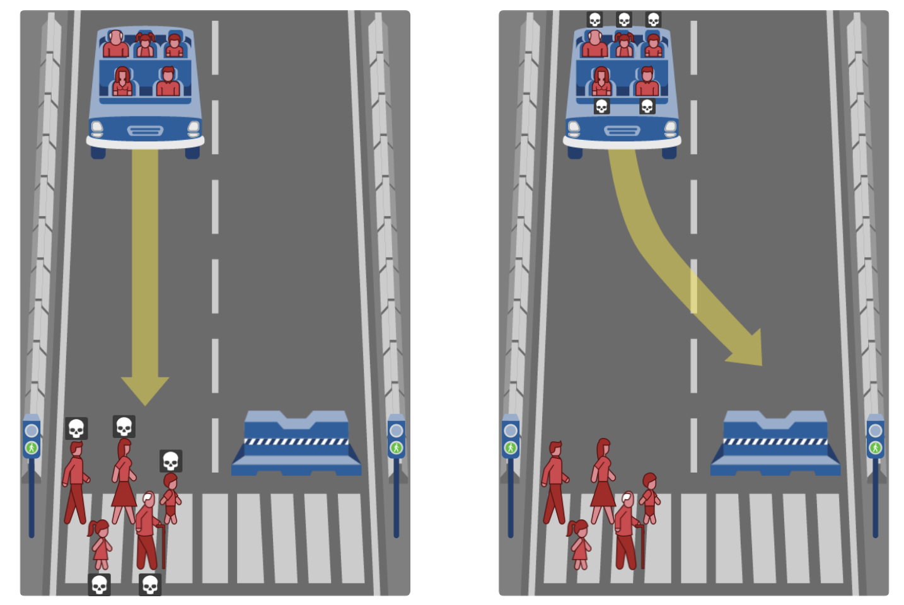

# Transplant Manager

## Learning Goals
* Practice creating and implementing `Comparator`
* Gain experience working with `PriorityQueue`
* Think about hard ethical decisions and translate them to code

## Key Terms and Concepts
* `Comparable` and `Comparator` - Interfaces used to order objects in Java based on natural and alternative ordering, respectively
* `PriorityQueue` - A priority queue is a special queue data structure where each element is associated with a priority value, and the higher priority elements are served first

## Description
You have graduated from Pomona, and you are now working as an engineer for a healthcare company. Your team has been assigned to create an automated transplant manager that will determine who will be prioritized for a liver transplant for a local hospital. The objective for your team is to automate this process and determine who’s lives will be saved based on a certain criteria that you will create. 

As an engineer, your job is to implement the manager and develop a new comparator that prioritizes some individuals over others based on their attributes. With only a limited number of available transplants, your decisions will be a matter of life or death for many of these individuals. Think critically about what attributes you want to consider and how much weight each of these attributes should hold. 

We provide you with the `Person` class and parts of the `TransplantManager`. You will need to implement the `Scenario`, `Engine`, and the rest of `TransplantManager`. Refer to the documentation below for more information on these classes. They are listed in the order you will need to implement for the TransplantManager program.

## Before Moving Further
While not situated in the context of organ transplants, similar questions have been explored through questions like the trolley problem and in the context of autonomous vehicles. 

Briefly explore the [Moral Machine](http://moralmachine.mit.edu/), where you are tasked with choosing how the autonomous vehicle should move given the situation.
<p align="center">

</p> 

### TO DO
* Visit the [Moral Machine](http://moralmachine.mit.edu/)
* Click “Start Judging” and, with your partner, and together, decide who you will save in each scenario.
  * At the end of the sequence of scenarios, the Moral Machine will try to tell you if your group biased your decisions towards any particular scenario or people group.
  * It may be helpful for you to read the descriptions for each image. 
* Record biases that the Moral Machine told you that you/your group has.
* Were you surprised by the reported biases? Write about your experiences with the Moral Machine in 6-8 sentences.

## Classes 
### `Person` 
The `Person` class details how to create a `Person` object and what options are available for each attribute. Every Person must have a `category`, `gender`, and `diseaseSeverity`. For a `Person` with a category of “adult”, they are also assigned a `profession`, `fitnessLevel`, `substanceUse`, and `familyStatus`. Since these attributes may not fit for children and elderly, they will not be assigned such values.

The method `createRandomPerson` will allow us to generate random `Person` objects for our `Scenario`.

### `Scenario` 
This class you will implement yourself. A Scenario is comprised of a set of people waiting to receive a liver transplant. You will write define the following:
* constructor for Scenario that takes Person[] people
* A getter for our private instance variable people, that returns the people of type Person[]
* A toString method that looks like
```
  Transplant candidates waiting to receive a liver transplant: 
  1. [moderate disease; female; child]
  2. [severe disease; male; adult; profession: unknown; fitness level: average; substance use: none; family status: married]
  # …
  # Until all people printed
```
A method with signature `public static Scenario createRandomScenario(int numPeople)`. This will create a Scenario containing numPeople randomly generated Person objects.

### `Engine`  
This class you will also implement yourself. The `Engine` is where we will define a way to prioritize people and write our comparators for determining the order in which people will receive transplants. You will write define the following:
* A static method with signature `public static PriorityQueue<Person> prioritizePeople(Scenario scenario, Comparator<Person> comp)`. In this method, we will return a new PriorityQueue that uses our given Comparator and adds the people from our Scenario.
* A static method with signature `public static final Comparator<Person> diseaseSeverityComp` that compares each Person based on their disease severity. 
  * To calculate the priority score, should add 1 to the index of the value in the attribute order ArrayLists 
  * For example: the score of a Person with “moderate” severity is 2
  * Note: to compare the scores, can use Integer.compare. Since this will be a max priority queue, you must identify the correct order in which to compare the scores
* A static method with signature `public static final Comparator<Person> weightedSeverityCategoryComp` that prioritize people based on severity of disease and category but weighs severity 2 times more than category
  * Similarly to the previous method but uses two attributes
  * For example: the score of a Person with “moderate” severity and “child” would be 2 * 2 + 3 = 7
* A static method with signature `public static final Comparator<Person> newComparator` where you write your own comparator for prioritizing the people using ≥ 4 attributes
  * Note: since adults recieve have some attributes that other categories do not, how will you calculate that into your comparator?

### `TransplantManager`
This class will be the place where all the pieces come together. You are given most of the code on how the transplant patients will be printed out. 

After the user’s input has been validated for which comparator they want to use, you are in charge of using the Engine and selected comparator to prioritize the people in the scenario. You should print out the top availableTransplants people. When run, the output should look like …

```
===========================================
Transplant Manager
===========================================

Transplant candidates waiting to receive a liver transplant: 
1: [moderate disease; female; child]
2: [severe disease; non-binary; baby]
3: [severe disease; male; adult; profession: unknown; fitness level: average; substance use: none; family status: married]
4: [mild disease; non-binary; adult; profession: homeless; fitness level: athletic; substance use: alcohol; family status: single]
5: [moderate disease; non-binary; elderly]

Select how you want to prioritize transplant recipients: 
1. By Disease Severity
2. By Disease Severity and Candidate Category
3. Using my own Comparator
2

The 3 people who will receive transplants in this order: 
1. [severe disease; male; adult; profession: unknown; fitness level: average; substance use: none; family status: married]
2. [severe disease; non-binary; baby]
3. [moderate disease; female; child]

Hit 'q' to quit or any key to continue to new scenario: 

Transplant candidates waiting to receive a liver transplant: 
1: [mild disease; non-binary; elderly]
2: [severe disease; non-binary; baby]
3: [severe disease; male; child]
4: [severe disease; female; elderly]
5: [severe disease; female; elderly]

Select how you want to prioritize transplant recipients: 
1. By Disease Severity
2. By Disease Severity and Candidate Category
3. Using my own Comparator
1

The 3 people who will receive transplants in this order: 
1. [severe disease; non-binary; baby]
2. [severe disease; female; elderly]
3. [severe disease; female; elderly]

Hit 'q' to quit or any key to continue to new scenario: 
q
Done
```

## Grading 
You will be graded based on the following criteria:

| Criterion - Total 16 points              | Points |
| :--------------------------------------- | :----- |
| Write up for Moral Machine activity      | 2      |
| `Scenario` class                         | 2      |
| `Engine` class with comparators          | 5      |
| `TransplantManager` class                | 2      |
| Write up for explaining your comparator  | 2      |
| Appropriate comments                     | 1      |
| JavaDoc + style                          | 1      |


